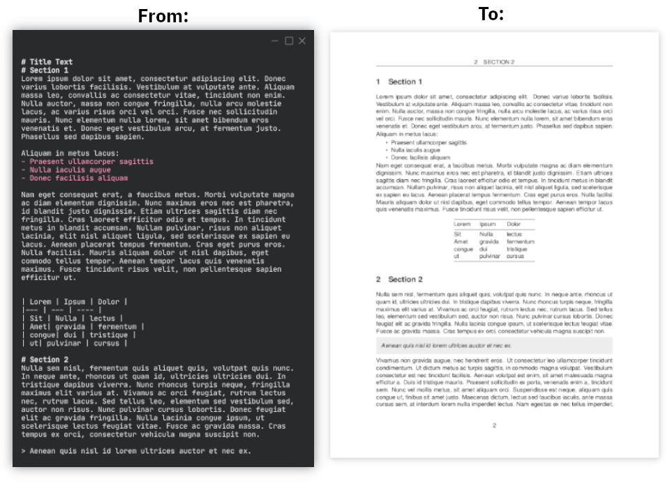

# NoteGen
A small script for generating LaTeX PDFs from Markdown using Pandoc metadata.

The script automatically fixes formatting errors that may produce incorrect documents by restructuring header spacing, removing repeated header text, trimming leading white-space, and other features resulting in consistent, high-quality output. All without editing the original file.

Due to some commands not supporting rewriting in-place, temporary files are used to accomodate for this. These files are automatically deleted upon script completion.

## Requirements:
- Pandoc
- Some form of LaTeX installation.
